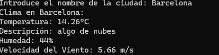
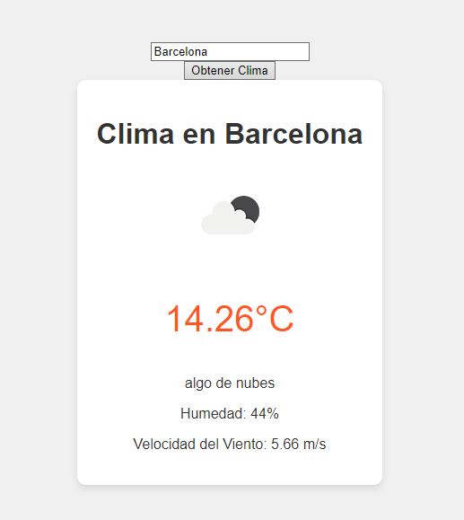

# API OpenWeather

> **Proyecto de aprendizaje (2023).** Primer contacto con APIs externas y manejo de credenciales. Parte de mi recorrido autodidacta: aprender haciendo cosas pequeñas que funcionan.

Consulta del clima en tiempo real usando la API de OpenWeather, implementada de **dos formas distintas** para entender el contraste entre arquitecturas client-side y server-side.





## Doble enfoque

El mismo objetivo (mostrar el clima de una ciudad) resuelto con dos arquitecturas diferentes:

| Enfoque | Pros | Contras |
|---------|------|---------|
| **Backend Node.js** (`app.js`) | API key oculta en `.env` del servidor | Requiere infraestructura (servidor corriendo) |
| **Frontend puro** (`index.html` + `script.js`) | Cero dependencias de servidor | API key expuesta en el navegador |

Implementar ambas versiones fue intencional: querer ver con mis propios ojos por qué las claves de servicios de pago (como Stripe) o las que tienen cuotas asociadas no deberían vivir en el cliente.

## Stack

- **Backend:** Node.js + Express
- **Frontend:** HTML + CSS + JavaScript vanilla
- **API externa:** [OpenWeather](https://openweathermap.org/api)
- **Testing:** archivo `request.http` para probar endpoints manualmente

## Cómo ejecutar

Necesitas una API key gratuita de OpenWeather: https://openweathermap.org/api

### Opción 1 — Backend Node.js

```bash
git clone https://github.com/Deivincci/api-openweather.git
cd api-openweather
npm install
```

Crea un archivo `.env` en la raíz:

```
OPENWEATHER_API_KEY=tu_clave_aqui
```

Arranca el servidor:

```bash
node app.js
```

Disponible en `http://localhost:3000`.

### Opción 2 — Frontend puro

Abre `index.html` directamente en el navegador. Edita el archivo y sustituye el placeholder de la API key por la tuya antes de usarlo.

> ⚠️ Esta opción expone la API key en el código del cliente. Útil solo para pruebas locales — no para producción.

## Notas de seguridad

- El archivo `.env` no se incluye en el repo (no se versionan credenciales).
- En la versión frontend, la clave está en el código por simplicidad didáctica. Para uso real lo correcto es proxiar todas las llamadas a través del backend.

## Contexto

Este repo forma parte de mi camino aprendiendo desarrollo: empecé con integraciones básicas como esta y fui sumando complejidad con el tiempo. Lo conservo archivado como referencia histórica del recorrido.

Trabajo más reciente en mi [perfil de GitHub](https://github.com/Deivincci).

## Licencia

[Apache License 2.0](LICENSE) — Copyright 2023 David Moral Peláez
